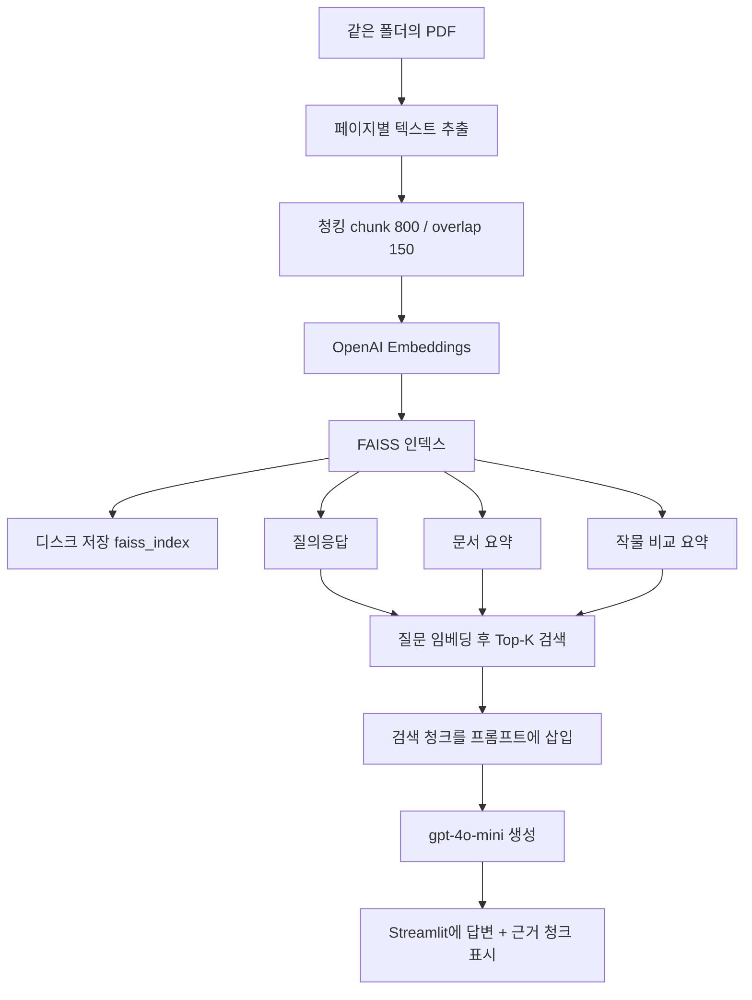

# 답안 소스 설명서

이 문서는 `app.py`가 **무엇을 하는지**, **왜 그렇게 짰는지**, **버튼을 누르면 어떤 함수가 도는지**를 쉽게 풀어 쓴 설명입니다.

핵심 한 줄:

> PDF를 잘라 벡터로 만든 뒤, 질문과 비슷한 조각만 찾아 LLM에게 넘겨 **문서에 있는 내용만** 답하게 한다. 이 방식이 **RAG**이다.

---

## 1. 이 프로그램이 하는 일

농촌진흥청 농업기술길잡이 PDF를 읽고, 사용자가 작물 재배를 물으면 **관련 페이지를 검색한 뒤** 그 내용으로 답합니다.

LLM(ChatGPT)에게 PDF 전체를 그대로 넣지 않습니다. 페이지가 200~370장이나 되어 토큰이 부족하고, 모델이 없는 내용을 지어낼 수 있기 때문입니다.

대신 아래 순서를 따릅니다.

```text
PDF 텍스트 추출
    → 청크(조각)로 자르기
    → OpenAI Embeddings로 숫자 벡터 만들기
    → FAISS에 저장
    → 질문이 들어오면 비슷한 청크 Top-K 검색
    → 그 청크만 LLM에 넣고 답변/요약 생성
    → Streamlit 화면에 답변 + 출처 표시
```

---

## 2. 파일 구성

```text
02_농업 문서 요약 및 질의응답 서비스/
├── app.py                  ← 전체 로직 + 화면 (이 설명의 대상)
├── requirements.txt        ← 설치할 라이브러리
├── faiss_index/            ← 한 번 만든 인덱스를 디스크에 저장
│   ├── index.faiss         벡터 검색 인덱스
│   ├── chunks.json         청크 원문 + 출처(파일명, 페이지)
│   └── meta.json           어떤 PDF, 몇 페이지로 만들었는지
├── 출력화면캡쳐.jpg
└── *.PDF                   ← 같은 폴더의 농업 기술 문서
```

API 키는 프로젝트 안에 두지 않고 `C:\env\.env`의 `OPENAI_API_KEY`를 읽습니다.

실행:

```bash
pip install -r requirements.txt
streamlit run app.py
```

---

## 3. RAG를 비유로 이해하기

도서관에서 숙제를 한다고 생각하면 됩니다.

| 단계 | 도서관 | 이 프로그램 |
|------|--------|-------------|
| 책을 꽂아 두기 | 사서에게 책을 맡김 | PDF → 청크 → 임베딩 → FAISS |
| 질문 | “딸기 정식 시기는?” | 사용자 입력 |
| 찾기 | 관련 책갈피 몇 장만 꺼냄 | FAISS Top-K 검색 |
| 답하기 | 그 페이지만 읽고 설명 | LLM이 검색된 청크로만 답변 |

**임베딩**은 문장을 “의미 좌표”로 바꾼 숫자 배열입니다.  
“정식 시기”와 “아주 심는 때”는 글자가 달라도 좌표가 가깝습니다.  
FAISS는 그 가까운 좌표를 빠르게 찾습니다. 키워드가 똑같이 있는지를 보는 것이 **아닙니다**.

---

## 4. 전체 흐름도



화면은 크게 둘로 나뉩니다.

- **사이드바**: PDF 선택, 최대 페이지, Top-K, 인덱스 생성
- **메인 탭**: 질의응답 / 문서 요약 / 작물 비교 요약

인덱스를 만들기 전에는 검색할 벡터가 없으므로, 질문부터 하면 “인덱스 생성을 먼저 하세요”라는 안내가 나옵니다.

---

## 5. 사용하는 라이브러리

`requirements.txt`에 있는 역할입니다.

| 라이브러리 | 역할 |
|------------|------|
| `openai` | 임베딩 API, 채팅 완성 API |
| `python-dotenv` | `.env`에서 API 키 로드 |
| `streamlit` | 웹 UI |
| `faiss-cpu` | 벡터 유사도 검색 |
| `numpy` | 벡터 배열, L2 정규화 |
| `pypdf` | PDF 페이지 텍스트 추출 |

---

## 6. `app.py`를 위에서부터 읽기

파일은 대략 네 덩어리입니다.

1. **설정** — 경로, 모델 이름, 시스템 프롬프트
2. **문서 처리** — PDF 로드, 청킹, 임베딩, FAISS
3. **생성** — 질의응답 / 요약 / 비교
4. **화면** — `main()` 안의 Streamlit UI

---

### 6.1 환경 설정과 상수 (1~45행)

```20:29:app.py
load_dotenv(r"C:\env\.env")

BASE_DIR = Path(__file__).resolve().parent
INDEX_DIR = BASE_DIR / "faiss_index"

EMBED_MODEL = "text-embedding-3-small"
CHAT_MODEL = "gpt-4o-mini"
CHUNK_SIZE = 800
CHUNK_OVERLAP = 150
EMBED_BATCH = 100
```

- `BASE_DIR`: `app.py`가 있는 폴더. PDF를 **상대 경로**로 찾기 위해 사용합니다. 채점 PC에서도 같은 폴더에 PDF만 있으면 동작합니다.
- `EMBED_MODEL`: 텍스트 → 1536차원 벡터. 검색 전용으로 저렴하고 빠릅니다.
- `CHAT_MODEL`: 답변 생성용. 검색은 임베딩, 문장 작성은 채팅 모델로 **역할을 나눕니다**.
- `CHUNK_SIZE = 800`: 한 조각의 최대 글자 수.
- `CHUNK_OVERLAP = 150`: 앞 조각 끝 150자를 다음 조각 앞에 겹칩니다. 문장이 잘려도 의미가 이어지게 하려는 장치입니다.
- `EMBED_BATCH = 100`: API에 한 번에 넣을 문장 수. 청크가 많아도 100개씩 나눠 보냅니다.

시스템 프롬프트 세 개가 있는 이유:

| 변수 | 언제 쓰나 | 강조하는 규칙 |
|------|-----------|----------------|
| `QA_SYSTEM_PROMPT` | 질의응답 | 컨텍스트에 없으면 추측 금지 |
| `SUMMARY_SYSTEM_PROMPT` | 요약 | 없는 내용 보태지 말 것 |
| `COMPARE_SYSTEM_PROMPT` | 작물 비교 | 항목별로 비교, 없으면 없다고 말 것 |

세 기능 모두 “농업 기술 문서 기반”이고, **지어내지 말라**는 점이 같습니다.

---

### 6.2 PDF 목록 (`list_pdfs`)

같은 폴더에서 확장자가 `.pdf` / `.PDF`인 파일만 모아 이름순으로 정렬합니다.  
사이드바 다중 선택의 목록이 여기서 만들어집니다.

---

### 6.3 페이지 텍스트 추출 (`extract_pdf_pages`)

```57:67:app.py
def extract_pdf_pages(pdf_path: Path, max_pages: int) -> list[tuple[int, str]]:
    reader = PdfReader(str(pdf_path))
    n_pages = min(len(reader.pages), max_pages)
    ...
        if len(text) >= 30:
            pages.append((i + 1, text))
```

하는 일:

1. `pypdf`로 PDF를 연다.
2. `max_pages`까지만 읽는다. (기본 30, 슬라이더 최대 300)
3. 공백·빈 줄을 정리한다.
4. 글자가 30자 미만인 페이지(표지, 그림만 있는 쪽)는 버린다.
5. `(페이지번호, 텍스트)` 목록을 반환한다. 페이지 번호는 **1부터**입니다. 화면에 `p.29`처럼 보이도록 하기 위함입니다.

왜 `max_pages`가 필요한가?  
사과·고추 PDF는 350페이지가 넘습니다. 실습 시간에 전부 임베딩하면 오래 걸리고 비용도 커집니다. 필요한 만큼만 읽도록 조절합니다.

---

### 6.4 청킹 (`split_text`) — 왜 자르는가

임베딩 모델과 검색은 **적당한 길이의 조각**에서 잘 동작합니다.

- 한 페이지 전체를 한 벡터로 만들면, “정식”과 “저장”이 한 조각에 섞여 검색이 거칠어집니다.
- 너무 짧게 자르면 “정식은 9월에”처럼 주어가 빠진 조각이 됩니다.

이 함수는 글자를 `chunk_size`만큼 자르고, 다음 시작점을 `overlap`만큼 뒤로 당깁니다.

```text
원문:  [======== 1600자 ========]

청크1: [---- 800자 ----]
청크2:           [150자 겹침][---- 800자 ----]
```

겹치는 150자 덕분에, 잘린 문장의 앞부분이 다음 조각에도 남습니다.

---

### 6.5 문서 리스트 만들기 (`load_and_chunk`)

선택한 PDF마다 페이지를 읽고, 각 페이지를 다시 청크로 나눕니다.  
한 청크는 아래 형태입니다.

```python
{
    "page_content": "딸기 정식은 ...",      # 검색·생성에 쓰는 본문
    "metadata": {
        "source": "농업기술길잡이40_딸기.PDF",  # 출처 파일
        "page": 29,                            # 출처 페이지
        "chunk_id": 0,                         # 같은 페이지 안에서의 순서
    },
}
```

FAISS는 **숫자 벡터만** 저장합니다. “이 벡터가 어느 파일 몇 쪽인가”는 `chunks.json`(이 리스트)에 따로 둡니다.  
검색이 끝나면 벡터 번호(`idx`)로 이 리스트를 찾아 원문과 출처를 꺼냅니다.

---

### 6.6 임베딩 (`embed_texts`)

```115:125:app.py
def embed_texts(client: OpenAI, texts: list[str]) -> np.ndarray:
    ...
    arr = np.array(vectors, dtype="float32")
    norms = np.linalg.norm(arr, axis=1, keepdims=True)
    arr = arr / np.clip(norms, 1e-12, None)
    return arr
```

1. 텍스트 목록을 100개씩 OpenAI Embeddings API에 보냅니다.
2. 응답을 `index` 순으로 정렬합니다. (순서가 섞일 수 있어서)
3. `float32` 배열로 만듭니다. FAISS가 이 형식을 기대합니다.
4. **L2 정규화**: 각 벡터 길이를 1로 맞춥니다.

정규화를 하는 이유:

- 이 코드의 FAISS는 `IndexFlatIP`(내적, Inner Product)를 씁니다.
- 길이가 1인 벡터끼리의 내적은 **코사인 유사도**와 같습니다.
- 값이 1에 가까울수록 “의미가 비슷하다”는 뜻입니다.
- 화면에 보이는 `유사도 0.358`이 바로 이 점수입니다.

질문도 **같은 함수**로 임베딩합니다. 문서와 질문을 다른 모델로 임베딩하면 좌표 공간이 달라져 검색이 깨집니다.

---

### 6.7 FAISS 인덱스 (`build_faiss_index`)

```128:131:app.py
def build_faiss_index(vectors: np.ndarray) -> faiss.Index:
    index = faiss.IndexFlatIP(vectors.shape[1])
    index.add(vectors)
    return index
```

- `vectors.shape[1]`은 차원 수(1536)입니다.
- `IndexFlatIP`는 모든 벡터와 내적을 계산하는 **정확한 검색**입니다. 청크가 수백~수천 개 수준이면 이것으로 충분합니다.
- `add`하면 0번, 1번, 2번… 순서로 들어갑니다. 이 번호가 `documents` 리스트의 인덱스와 **같아야** 합니다. 그래서 임베딩할 때 `documents` 순서 그대로 넣습니다.

---

### 6.8 인덱스 저장과 로드 (선택 과제: 영속화)

한 번 임베딩하는 데 API 비용과 시간이 듭니다. 같은 PDF를 앱을 킬 때마다 다시 만들지 않도록 디스크에 저장합니다.

| 파일 | 내용 |
|------|------|
| `index.faiss` | FAISS 벡터 인덱스 |
| `chunks.json` | 청크 원문 + metadata |
| `meta.json` | 어떤 파일, 몇 페이지, 청크 크기, 임베딩 모델 |

Windows에서 `faiss.write_index(한글경로)`는 경로 인코딩 오류가 납니다.  
그래서 인덱스를 바이트로 직렬화한 뒤 Python `Path.write_bytes`로 저장합니다.

```text
저장: serialize_index → 파일로 기록
로드: 파일 읽기 → deserialize_index
```

앱을 다시 실행하면 `load_saved_index()`로 기존 인덱스를 **자동 로드**합니다. 사이드바의 “저장된 인덱스 불러오기”도 같은 함수입니다.

---

### 6.9 검색 (`search`) — 질문에서 근거를 찾는 핵심

```178:201:app.py
def search(...):
    query_vec = embed_texts(client, [query])
    scores, ids = index.search(query_vec, k)
    ...
```

순서:

1. 질문을 벡터로 만든다. (문서와 동일한 임베딩 모델)
2. FAISS에 “가장 가까운 k개”를 요청한다.
3. 돌아온 번호(`ids`)로 `documents[idx]`를 꺼낸다.
4. 본문 + 출처 + 유사도 점수를 묶어 반환한다.

`k = min(top_k, index.ntotal)`인 이유: 청크가 3개인데 Top-K를 4로 두면 FAISS가 빈 칸(-1)을 돌려줍니다. 그 경우는 건너뜁니다.

예시:

질문 “딸기 정식 시기와 주의점은?”  
→ 딸기 PDF p.29, p.12, p.7, p.5 청크가 상위에 옴  
→ 고구마 PDF는 의미가 멀어서 밀려남

---

### 6.10 프롬프트 조립 (`format_context`, `rag_answer`)

검색만 하고 끝나면 “관련 문장 찾기”입니다. **RAG의 생성 단계**는 검색된 글을 LLM 프롬프트에 넣는 일입니다.

`format_context`는 청크를 이런 문자열로 만듭니다.

```text
[근거 1] 출처: 농업기술길잡이40_딸기.PDF / p.29
(페이지에서 자른 본문)

[근거 2] 출처: ... / p.12
...
```

`rag_answer`는 시스템 역할 + 위 컨텍스트 + 질문을 함께 보냅니다.

```text
시스템: 컨텍스트에 있는 내용만 답하라. 없으면 "문서에서 확인되지 않습니다".
사용자: [검색된 청크들] + 질문
```

이렇게 하면 모델은 인터넷 지식이나 추측이 아니라, **지금 붙여 준 문서 조각**을 보고 답합니다.  
출처를 프롬프트에 넣어 두었기 때문에 답변 끝에 `(출처: … / p.29)`를 붙일 수 있습니다.

`temperature=0.2`는 창의적으로 지어내기보다, 짧게 사실 위주로 답하라는 설정입니다.

문서와 무관한 질문(“우주선은 어떻게 만드나요?”)은 검색 청크에 답이 없으므로, 프롬프트 규칙대로 **문서에서 확인되지 않습니다**가 나옵니다.

---

### 6.11 요약과 비교

질의응답과 **검색기는 같고**, LLM에게 시키는 일만 다릅니다.

| 기능 | 검색 질의 | LLM에게 시키는 일 |
|------|-----------|-------------------|
| 질의응답 | 사용자 질문 | 질문에 답하라 |
| 주제 요약 | 주제 문자열 (예: 토마토 육묘 관리) | 관련 청크만 요약하라 |
| 선택 문서 요약 | 검색 없음. 해당 PDF 앞부분 12청크 | 이 문서 핵심을 요약하라 |
| 작물 비교 | “문서A와 문서B의 병해충”처럼 항목마다 검색 | 항목별로 비교 정리하라 |

선택 문서 요약만 FAISS를 안 타는 이유: “이 책 앞부분을 요약해 달라”는 요청이라, 유사도 검색보다 **해당 파일의 앞 청크**가 더 맞습니다.

---

## 7. 화면(`main`)이 버튼과 함수를 연결하는 방식

Streamlit은 **위젯이 바뀔 때마다 `main()` 전체를 다시 실행**합니다.  
그래서 인덱스·답변을 일반 변수에 두면 화면이 갱신되며 사라집니다.  
`st.session_state`에 넣어 브라우저 세션 동안 기억합니다.

| session_state 키 | 의미 |
|------------------|------|
| `index` | FAISS 객체 |
| `documents` | 청크 리스트 |
| `index_ready` | 검색 가능 여부 |
| `qa_answer` / `qa_hits` | 마지막 질의응답 결과 |
| `sum_text` / `sum_hits` | 마지막 요약 |
| `cmp_text` / `cmp_hits` | 마지막 비교 요약 |

### 사이드바

- **선택 문서**: 다중 선택. 기본값은 딸기·고구마 PDF(있으면).
- **최대 페이지 수**: 5~300, 기본 30.
- **Top-K**: 검색해서 LLM에 넣을 청크 개수. 기본 4.
- **인덱스 생성**: `load_and_chunk` → `embed_texts` → `build_faiss_index` → `save_index`. PDF는 **2개 이상**이어야 합니다(과제 필수 조건).
- **저장된 인덱스 불러오기**: 디스크에서 재로드.

생성 중 진행률(35% 임베딩, 80% 저장)을 보여 주는 이유는, 페이지를 많이 읽으면 수십 초~수 분이 걸리기 때문입니다.

### 탭 1 — 질의응답

```text
질문 입력 → [답변 생성]
    → search(질문, top_k)
    → rag_answer(...)
    → 답변 표시
    → render_hits()로 근거 청크 + 유사도 표시
```

### 탭 2 — 문서 요약

- **주제 요약**: 질의응답과 같은 검색 후, 답을 쓰는 대신 요약을 요청.
- **선택 문서 요약**: 고른 PDF의 앞 12청크만 요약.

### 탭 3 — 작물 비교 요약 (선택 과제)

문서 A/B와 항목(정식 조건, 병해충, 저장 등)을 고르면, 항목마다 검색한 뒤 한 번에 비교문을 만듭니다.

`render_hits`는 세 탭이 공통으로 사용합니다. 첫 번째 청크만 펼쳐 두고, 나머지는 접어 화면을 짧게 유지합니다.

---

## 8. “인덱스 생성”을 눌렀을 때 한 줄씩

과제 예시 화면과 같은 설정이라고 가정합니다.

- 선택: 딸기 PDF, 고구마 PDF
- 최대 페이지: 30
- Top-K: 4

```text
1. 두 PDF에서 앞에서 30쪽까지 텍스트를 뽑는다.
2. 쪽마다 800자 단위로 자르고 150자 겹친다.  (예: 청크 82개)
3. 82개 문장을 text-embedding-3-small로 벡터화한다.
4. 벡터를 L2 정규화하고 FAISS IndexFlatIP에 넣는다.
5. faiss_index/ 폴더에 인덱스·청크·메타를 저장한다.
6. 사이드바에 "인덱스 준비 완료 (청크 82개)"를 보여 준다.
```

이후 “딸기 정식 시기와 주의점은?”을 물으면:

```text
7. 질문 1개를 같은 방식으로 임베딩한다.
8. FAISS가 82개 중 가장 가까운 4개를 고른다.
9. 4개 본문 + 출처를 프롬프트에 넣는다.
10. gpt-4o-mini가 근거 기반으로 한국어 답변을 쓴다.
11. 답변 아래 근거 청크(파일명, 페이지, 유사도)를 표시한다.
```

---

## 9. 과제 확인 질문과 코드의 연결

실습과제 13번 질문에 대한 답이고, 사이드바 펼침 메뉴에도 같은 내용이 있습니다.

**1. RAG 없이 LLM만으로 PDF를 답하면?**  
모델은 PDF를 실시간으로 읽지 않습니다. 학습 때 본 일반적인 농업 지식으로 답하거나 환각(없는 약제·시기를 지어냄)이 납니다. 출처 페이지도 없습니다.  
→ 이 코드는 반드시 `search()` 결과를 프롬프트에 넣습니다.

**2. chunk_size / overlap을 너무 크거나 작게 잡으면?**

| | 너무 큼 | 너무 작음 |
|--|---------|-----------|
| `chunk_size` | 한 조각에 주제가 섞임, 검색이 거칠고 토큰 낭비 | 문맥 단절, “그것/이때”만 있는 조각 |
| `overlap` | 중복 청크가 늘어 인덱스·비용 증가 | 잘린 문장이 어느 조각에도 온전히 안 남음 |

이 답안은 과제 권장 구간(600~1000 / 100~200)의 중간인 **800 / 150**을 씁니다.

**3. FAISS는 키워드 일치인가, 의미 유사도인가?**  
**의미 유사도**입니다. 임베딩 벡터의 내적(코사인)입니다. “정식”이라는 단어가 없어도 “아주 심는 시기” 문장이 상위에 올 수 있습니다.

**4. 검색된 청크를 LLM 프롬프트에 넣는 이유는?**  
생성 모델에게 **이번 질문의 근거 자료**를 주기 위해서입니다. 검색만 하면 사용자에게 원문 나열만 되고, 생성만 하면 근거가 없습니다. 둘을 잇는 지점이 RAG입니다.

**5. 문서에 없는 질문은?**  
시스템 프롬프트에 “없으면 `문서에서 확인되지 않습니다`”를 명시했고, 컨텍스트 밖을 추측하지 말라고 했습니다. 우주선 질문으로 이 동작을 확인합니다.

---

## 10. 자주 만나는 동작 / 주의점

**인덱스를 다시 만들어야 하는 경우**  
PDF 선택을 바꾸거나, 최대 페이지를 크게 올린 뒤에는 사이드바에서 **인덱스 생성을 다시** 눌러야 새 내용이 검색에 반영됩니다. 자동 로드되는 것은 **마지막으로 저장한** 인덱스입니다.

**페이지를 300까지 올리면**  
청크 수와 임베딩 시간이 크게 늘어납니다. 처음에는 30페이지로 동작을 확인한 뒤, 필요할 때만 올리는 것이 좋습니다.

**그림만 있는 페이지**  
`pypdf`는 글자만 뽑습니다. 스캔 이미지에 OCR이 없으면 해당 쪽은 비어 30자 미만으로 건너뜁니다.

**유사도 점수가 0.3대여도 정상인 경우**  
긴 청크와 짧은 질문의 코사인 값은 1.0이 잘 나오지 않습니다. 중요한 것은 **절대값보다 순위**(딸기 질문이 딸기 PDF 쪽에  mo이는지)입니다.

---

## 11. 함수 빠른 찾아보기

| 함수 | 한 줄 설명 |
|------|------------|
| `list_pdfs` | 폴더의 PDF 파일 목록 |
| `extract_pdf_pages` | PDF에서 페이지 텍스트 추출 |
| `split_text` | 긴 글을 overlap 있게 분할 |
| `load_and_chunk` | PDF들 → Document 리스트 |
| `embed_texts` | 텍스트 → 정규화된 벡터 |
| `build_faiss_index` | 벡터를 FAISS에 적재 |
| `save_index` / `load_saved_index` | 디스크 저장·복원 |
| `search` | 질문과 비슷한 청크 Top-K |
| `format_context` | 청크를 LLM용 문자열로 조립 |
| `rag_answer` | 근거 기반 질의응답 |
| `summarize_hits` | 근거 기반 요약 |
| `compare_crops` | 항목별 비교 요약 |
| `render_hits` | 근거 청크 UI |
| `main` | Streamlit 화면과 위 함수 연결 |

코드를 따라갈 때는 `main()`의 **인덱스 생성 버튼**과 **답변 생성 버튼** 두 곳만 먼저 보면 전체 그림이 잡힙니다. 나머지는 그 두 길이 호출하는 도구입니다.
